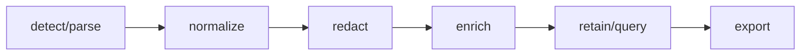

## Overview

OpenTelemetry-compatible log normalization parsers redaction indexing and query pipelines for tuil.

`@mwillbanks/tuil-logging` is independently installable and also participates in the
umbrella `@mwillbanks/tuil` runtime where applicable.

## Installation

```npm
npm install @mwillbanks/tuil-logging
```

## How it operates

Logging adapters normalize OpenTelemetry, JSON, syslog, journald, container, and text records, redact before retention, enrich, query, and export bounded data.



## API

| API | Signature | Description |
| --- | --- | --- |
| [`builtInLogParsers`](/docs/reference/packages/logging/api/built-in-log-parsers) | `constant builtInLogParsers` | Public constant builtInLogParsers. |
| [`commonLogParser`](/docs/reference/packages/logging/api/common-log-parser) | `constant commonLogParser` | Public constant commonLogParser. |
| [`compileLogQuery`](/docs/reference/packages/logging/api/compile-log-query) | `function compileLogQuery` | Public function compileLogQuery. |
| [`containerLogParser`](/docs/reference/packages/logging/api/container-log-parser) | `constant containerLogParser` | Public constant containerLogParser. |
| [`journaldParser`](/docs/reference/packages/logging/api/journald-parser) | `constant journaldParser` | Public constant journaldParser. |
| [`jsonLogParser`](/docs/reference/packages/logging/api/json-log-parser) | `constant jsonLogParser` | Public constant jsonLogParser. |
| [`LogBufferStatistics`](/docs/reference/packages/logging/api/log-buffer-statistics) | `interface LogBufferStatistics` | Public interface LogBufferStatistics. |
| [`LogDiagnostic`](/docs/reference/packages/logging/api/log-diagnostic) | `interface LogDiagnostic` | Public interface LogDiagnostic. |
| [`LogEnricher`](/docs/reference/packages/logging/api/log-enricher) | `interface LogEnricher` | Public interface LogEnricher. |
| [`LogParser`](/docs/reference/packages/logging/api/log-parser) | `interface LogParser` | Public interface LogParser. |
| [`LogPipeline`](/docs/reference/packages/logging/api/log-pipeline) | `class LogPipeline` | Public class LogPipeline. |
| [`LogRecord`](/docs/reference/packages/logging/api/log-record) | `interface LogRecord` | Public interface LogRecord. |
| [`LogRedactor`](/docs/reference/packages/logging/api/log-redactor) | `interface LogRedactor` | Public interface LogRedactor. |
| [`LogSource`](/docs/reference/packages/logging/api/log-source) | `type LogSource` | Public type LogSource. |
| [`normalizeSeverity`](/docs/reference/packages/logging/api/normalize-severity) | `function normalizeSeverity` | Public function normalizeSeverity. |
| [`openTelemetryLogParser`](/docs/reference/packages/logging/api/open-telemetry-log-parser) | `constant openTelemetryLogParser` | Public constant openTelemetryLogParser. |
| [`processLogParser`](/docs/reference/packages/logging/api/process-log-parser) | `constant processLogParser` | Public constant processLogParser. |
| [`syslogParser`](/docs/reference/packages/logging/api/syslog-parser) | `constant syslogParser` | Public constant syslogParser. |
| [`textLogParser`](/docs/reference/packages/logging/api/text-log-parser) | `constant textLogParser` | Public constant textLogParser. |

## Events and lifecycle

Pipelines return normalized records and observable snapshots; original payloads are never exposed before redaction.

All subscriptions and registrations return a disposer or belong to an owning
runtime that disposes them in reverse order.

## Example

```tsx
import { LogPipeline } from "@mwillbanks/tuil-logging";

const pipeline = new LogPipeline({ capacity: 100_000 });
pipeline.ingest(line);
```

## Related

- [Package architecture](/docs/concepts/packages)
- [Events](/docs/concepts/events)
- [Testing](/docs/guides/testing)
