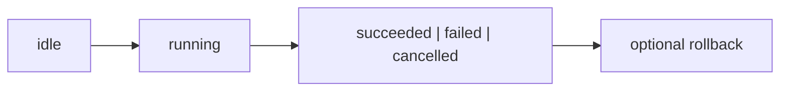

## Overview

Observable asynchronous operations, progress, retries, rollback, and cancellation for tuil.

`@mwillbanks/tuil-operations` is independently installable and also participates in the
umbrella `@mwillbanks/tuil` runtime where applicable.

## Installation

```npm
npm install @mwillbanks/tuil-operations
```

## How it operates

Operation executors track progress, retries, cancellation, timeouts, dependencies, rollback, logs, and immutable observable snapshots.



## API

| Export | Kind | Source |
| --- | --- | --- |
| `createOperation` | function | `packages/operations/src/index.ts` |
| `defineOperation` | function | `packages/operations/src/index.ts` |
| `OperationBlockedError` | class | `packages/operations/src/index.ts` |
| `OperationContext` | interface | `packages/operations/src/index.ts` |
| `OperationDefinition` | interface | `packages/operations/src/index.ts` |
| `OperationError` | interface | `packages/operations/src/index.ts` |
| `OperationEvent` | interface | `packages/operations/src/index.ts` |
| `OperationExecutor` | class | `packages/operations/src/index.ts` |
| `OperationExecutorOptions` | interface | `packages/operations/src/index.ts` |
| `OperationFeedback` | type | `packages/operations/src/index.ts` |
| `operationFeedbackDelays` | constant | `packages/operations/src/index.ts` |
| `OperationProgress` | interface | `packages/operations/src/index.ts` |
| `OperationSnapshot` | interface | `packages/operations/src/index.ts` |
| `OperationStatus` | type | `packages/operations/src/index.ts` |
| `OperationTimeoutError` | class | `packages/operations/src/index.ts` |
| `resolveOperationFeedback` | function | `packages/operations/src/index.ts` |

## Events and lifecycle

Executors expose snapshot subscriptions and operation progress rather than stringly typed global events.

All subscriptions and registrations return a disposer or belong to an owning
runtime that disposes them in reverse order.

## Example

```tsx
const operation = defineOperation({ id: "build", run: async ({ progress }) => progress(1) });
```

## Related

- [Package architecture](/docs/concepts/packages)
- [Events](/docs/concepts/events)
- [Testing](/docs/guides/testing)
