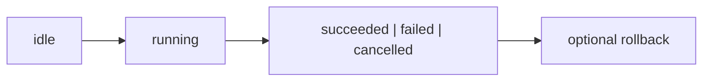

## Overview

Observable asynchronous operations, progress, retries, rollback, and cancellation for tuil.

`@mwillbanks/tuil-operations` is independently installable and also participates in the
umbrella `@mwillbanks/tuil` runtime where applicable.

## Installation

```npm
npm install @mwillbanks/tuil-operations
```

## How it operates

Operation executors track progress, retries, cancellation, timeouts, dependencies, rollback, logs, and immutable observable snapshots.



## API

| API | Signature | Description |
| --- | --- | --- |
| [`createOperation`](/docs/reference/packages/operations/api/create-operation) | `function createOperation` | Public function createOperation. |
| [`defineOperation`](/docs/reference/packages/operations/api/define-operation) | `function defineOperation` | Public function defineOperation. |
| [`OperationBlockedError`](/docs/reference/packages/operations/api/operation-blocked-error) | `class OperationBlockedError` | Public class OperationBlockedError. |
| [`OperationContext`](/docs/reference/packages/operations/api/operation-context) | `interface OperationContext` | Public interface OperationContext. |
| [`OperationDefinition`](/docs/reference/packages/operations/api/operation-definition) | `interface OperationDefinition` | Public interface OperationDefinition. |
| [`OperationError`](/docs/reference/packages/operations/api/operation-error) | `interface OperationError` | Public interface OperationError. |
| [`OperationEvent`](/docs/reference/packages/operations/api/operation-event) | `interface OperationEvent` | Public interface OperationEvent. |
| [`OperationExecutor`](/docs/reference/packages/operations/api/operation-executor) | `class OperationExecutor` | Public class OperationExecutor. |
| [`OperationExecutorOptions`](/docs/reference/packages/operations/api/operation-executor-options) | `interface OperationExecutorOptions` | Public interface OperationExecutorOptions. |
| [`OperationFeedback`](/docs/reference/packages/operations/api/operation-feedback) | `type OperationFeedback` | Public type OperationFeedback. |
| [`operationFeedbackDelays`](/docs/reference/packages/operations/api/operation-feedback-delays) | `constant operationFeedbackDelays` | Public constant operationFeedbackDelays. |
| [`OperationProgress`](/docs/reference/packages/operations/api/operation-progress) | `interface OperationProgress` | Public interface OperationProgress. |
| [`OperationSnapshot`](/docs/reference/packages/operations/api/operation-snapshot) | `interface OperationSnapshot` | Public interface OperationSnapshot. |
| [`OperationStatus`](/docs/reference/packages/operations/api/operation-status) | `type OperationStatus` | Public type OperationStatus. |
| [`OperationTimeoutError`](/docs/reference/packages/operations/api/operation-timeout-error) | `class OperationTimeoutError` | Public class OperationTimeoutError. |
| [`resolveOperationFeedback`](/docs/reference/packages/operations/api/resolve-operation-feedback) | `function resolveOperationFeedback` | Public function resolveOperationFeedback. |

## Events and lifecycle

Executors expose snapshot subscriptions and operation progress rather than stringly typed global events.

All subscriptions and registrations return a disposer or belong to an owning
runtime that disposes them in reverse order.

## Example

```tsx
import { defineOperation } from "@mwillbanks/tuil-operations";

const operation = defineOperation({ id: "build", run: async ({ progress }) => progress(1) });
```

## Related

- [Package architecture](/docs/concepts/packages)
- [Events](/docs/concepts/events)
- [Testing](/docs/guides/testing)
