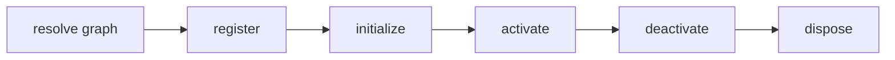

## Overview

Dependency-aware plugin registration, resolution, activation, and teardown for tuil.

`@mwillbanks/tuil-plugin` is independently installable and also participates in the
umbrella `@mwillbanks/tuil` runtime where applicable.

## Installation

```npm
npm install @mwillbanks/tuil-plugin
```

## How it operates

Plugins declare capabilities and dependencies, register services, commands, events, and typed extension points, then activate in dependency order with deterministic reverse teardown.



## API

| API | Signature | Description |
| --- | --- | --- |
| [`DefaultExtensionPoints`](/docs/reference/packages/plugin/api/default-extension-points) | `interface DefaultExtensionPoints` | Public interface DefaultExtensionPoints. |
| [`ExtensionPointMap`](/docs/reference/packages/plugin/api/extension-point-map) | `type ExtensionPointMap` | Public type ExtensionPointMap. |
| [`ExtensionRegistry`](/docs/reference/packages/plugin/api/extension-registry) | `interface ExtensionRegistry` | Public interface ExtensionRegistry. |
| [`Plugin`](/docs/reference/packages/plugin/api/plugin) | `interface Plugin` | Public interface Plugin. |
| [`PluginCapability`](/docs/reference/packages/plugin/api/plugin-capability) | `type PluginCapability` | Public type PluginCapability. |
| [`PluginContext`](/docs/reference/packages/plugin/api/plugin-context) | `interface PluginContext` | Public interface PluginContext. |
| [`PluginRegistryEntry`](/docs/reference/packages/plugin/api/plugin-registry-entry) | `interface PluginRegistryEntry` | Public interface PluginRegistryEntry. |
| [`PluginRegistryQuery`](/docs/reference/packages/plugin/api/plugin-registry-query) | `interface PluginRegistryQuery` | Public interface PluginRegistryQuery. |

## Events and lifecycle

Plugins may declare or subscribe to the host application event map. Plugin health is exposed as an observable runtime surface.

All subscriptions and registrations return a disposer or belong to an owning
runtime that disposes them in reverse order.

## Example

```tsx
const plugin = createPlugin({ id: "analytics", activate(context) { return context.events.observe(track); } });
```

## Related

- [Package architecture](/docs/concepts/packages)
- [Events](/docs/concepts/events)
- [Testing](/docs/guides/testing)
