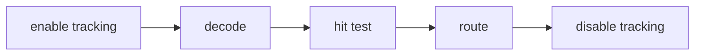

## Overview

Renderer-neutral terminal pointer parsing, hit testing, capture, and dispatch for tuil.

`@mwillbanks/tuil-pointer` is independently installable and also participates in the
umbrella `@mwillbanks/tuil` runtime where applicable.

## Installation

```npm
npm install @mwillbanks/tuil-pointer
```

## How it operates

Pointer input parses SGR sequences, hit-tests shared layout bounds, and routes capture and bubble phases for click, hover, drag, wheel, and focus behavior.



## API

| Export | Kind | Source |
| --- | --- | --- |
| `DecodedPointerInput` | interface | `packages/pointer/src/index.ts` |
| `ParsedPointerInput` | interface | `packages/pointer/src/index.ts` |
| `parseSgrPointer` | function | `packages/pointer/src/index.ts` |
| `PointerButton` | type | `packages/pointer/src/index.ts` |
| `PointerEventType` | type | `packages/pointer/src/index.ts` |
| `PointerModifiers` | interface | `packages/pointer/src/index.ts` |

## Events and lifecycle

Normalized pointer events carry coordinates, buttons, modifiers, phase, and propagation state.

All subscriptions and registrations return a disposer or belong to an owning
runtime that disposes them in reverse order.

## Example

```tsx
const event = parseSgrPointer(sequence);
```

## Related

- [Package architecture](/docs/concepts/packages)
- [Events](/docs/concepts/events)
- [Testing](/docs/guides/testing)
