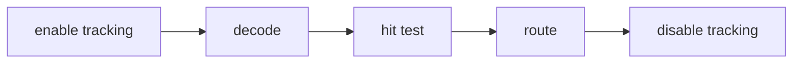

## Overview

Renderer-neutral terminal pointer parsing, hit testing, capture, and dispatch for tuil.

`@mwillbanks/tuil-pointer` is independently installable and also participates in the
umbrella `@mwillbanks/tuil` runtime where applicable.

## Installation

```npm
npm install @mwillbanks/tuil-pointer
```

## How it operates

Pointer input parses SGR sequences, hit-tests shared layout bounds, and routes capture and bubble phases for click, hover, drag, wheel, and focus behavior.



## API

| API | Signature | Description |
| --- | --- | --- |
| [`DecodedPointerInput`](/docs/reference/packages/pointer/api/decoded-pointer-input) | `interface DecodedPointerInput` | Public interface DecodedPointerInput. |
| [`ParsedPointerInput`](/docs/reference/packages/pointer/api/parsed-pointer-input) | `interface ParsedPointerInput` | Public interface ParsedPointerInput. |
| [`parseSgrPointer`](/docs/reference/packages/pointer/api/parse-sgr-pointer) | `function parseSgrPointer` | Public function parseSgrPointer. |
| [`PointerButton`](/docs/reference/packages/pointer/api/pointer-button) | `type PointerButton` | Public type PointerButton. |
| [`PointerEventType`](/docs/reference/packages/pointer/api/pointer-event-type) | `type PointerEventType` | Public type PointerEventType. |
| [`PointerModifiers`](/docs/reference/packages/pointer/api/pointer-modifiers) | `interface PointerModifiers` | Public interface PointerModifiers. |

## Events and lifecycle

Normalized pointer events carry coordinates, buttons, modifiers, phase, and propagation state.

All subscriptions and registrations return a disposer or belong to an owning
runtime that disposes them in reverse order.

## Example

```tsx
import { parseSgrPointer } from "@mwillbanks/tuil-pointer";

const event = parseSgrPointer(sequence);
```

## Related

- [Package architecture](/docs/concepts/packages)
- [Events](/docs/concepts/events)
- [Testing](/docs/guides/testing)
