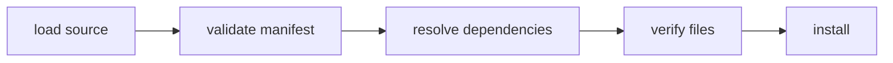

## Overview

Source-owned component and block registry contracts for tuil.

`@mwillbanks/tuil-registry` is independently installable and also participates in the
umbrella `@mwillbanks/tuil` runtime where applicable.

## Installation

```npm
npm install @mwillbanks/tuil-registry
```

## How it operates

Registry sources describe source-owned components, blocks, themes, dependencies, files, and integrity metadata. HTTP sources enforce secure URL and package metadata boundaries.



## API

| API | Signature | Description |
| --- | --- | --- |
| [`applyRegistryCodemods`](/docs/reference/packages/registry/api/apply-registry-codemods) | `function applyRegistryCodemods` | Public function applyRegistryCodemods. |
| [`createRegistryLockfile`](/docs/reference/packages/registry/api/create-registry-lockfile) | `function createRegistryLockfile` | Public function createRegistryLockfile. |
| [`FileRegistrySource`](/docs/reference/packages/registry/api/file-registry-source) | `class FileRegistrySource` | Public class FileRegistrySource. |
| [`HttpRegistrySource`](/docs/reference/packages/registry/api/http-registry-source) | `class HttpRegistrySource` | Public class HttpRegistrySource. |
| [`InstallResult`](/docs/reference/packages/registry/api/install-result) | `interface InstallResult` | Public interface InstallResult. |
| [`parseRegistryItem`](/docs/reference/packages/registry/api/parse-registry-item) | `function parseRegistryItem` | Public function parseRegistryItem. |
| [`provenanceComment`](/docs/reference/packages/registry/api/provenance-comment) | `function provenanceComment` | Public function provenanceComment. |
| [`RegistryClient`](/docs/reference/packages/registry/api/registry-client) | `class RegistryClient` | Public class RegistryClient. |
| [`RegistryCodemod`](/docs/reference/packages/registry/api/registry-codemod) | `interface RegistryCodemod` | Public interface RegistryCodemod. |
| [`registryCompatibilityIssues`](/docs/reference/packages/registry/api/registry-compatibility-issues) | `function registryCompatibilityIssues` | Public function registryCompatibilityIssues. |
| [`RegistryDiff`](/docs/reference/packages/registry/api/registry-diff) | `interface RegistryDiff` | Public interface RegistryDiff. |
| [`RegistryFile`](/docs/reference/packages/registry/api/registry-file) | `interface RegistryFile` | Public interface RegistryFile. |
| [`RegistryIndexEntry`](/docs/reference/packages/registry/api/registry-index-entry) | `interface RegistryIndexEntry` | Public interface RegistryIndexEntry. |
| [`RegistryInstaller`](/docs/reference/packages/registry/api/registry-installer) | `class RegistryInstaller` | Public class RegistryInstaller. |
| [`RegistryInstallOptions`](/docs/reference/packages/registry/api/registry-install-options) | `interface RegistryInstallOptions` | Public interface RegistryInstallOptions. |
| [`registryIntegrity`](/docs/reference/packages/registry/api/registry-integrity) | `function registryIntegrity` | Public function registryIntegrity. |
| [`RegistryItem`](/docs/reference/packages/registry/api/registry-item) | `interface RegistryItem` | Public interface RegistryItem. |
| [`RegistryItemType`](/docs/reference/packages/registry/api/registry-item-type) | `type RegistryItemType` | Public type RegistryItemType. |
| [`RegistryLockfile`](/docs/reference/packages/registry/api/registry-lockfile) | `interface RegistryLockfile` | Public interface RegistryLockfile. |
| [`RegistrySource`](/docs/reference/packages/registry/api/registry-source) | `interface RegistrySource` | Public interface RegistrySource. |
| [`RegistryTransformOptions`](/docs/reference/packages/registry/api/registry-transform-options) | `interface RegistryTransformOptions` | Public interface RegistryTransformOptions. |
| [`RemoveResult`](/docs/reference/packages/registry/api/remove-result) | `interface RemoveResult` | Public interface RemoveResult. |
| [`verifyRegistryLockfile`](/docs/reference/packages/registry/api/verify-registry-lockfile) | `function verifyRegistryLockfile` | Public function verifyRegistryLockfile. |

## Events and lifecycle

Registry resolution returns explicit results and diagnostics. It does not emit runtime application events.

All subscriptions and registrations return a disposer or belong to an owning
runtime that disposes them in reverse order.

## Example

```tsx
import { HttpRegistrySource } from "@mwillbanks/tuil-registry";

const source = new HttpRegistrySource("official", "https://example.com/registry");
```

## Related

- [Package architecture](/docs/concepts/packages)
- [Events](/docs/concepts/events)
- [Testing](/docs/guides/testing)
