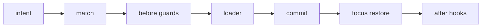

## Overview

Typed terminal routes, guards, history, loaders, layouts, and focus restoration for tuil.

`@mwillbanks/tuil-router` is independently installable and also participates in the
umbrella `@mwillbanks/tuil` runtime where applicable.

## Installation

```npm
npm install @mwillbanks/tuil-router
```

## How it operates

The terminal router matches typed routes, executes guards and loaders, manages history and layouts, exposes navigation surfaces, and restores focus after transitions.



## API

| API | Signature | Description |
| --- | --- | --- |
| [`createRouter`](/docs/reference/packages/router/api/create-router) | `function createRouter` | Public function createRouter. |
| [`defineRoutes`](/docs/reference/packages/router/api/define-routes) | `function defineRoutes` | Public function defineRoutes. |
| [`FocusSnapshot`](/docs/reference/packages/router/api/focus-snapshot) | `interface FocusSnapshot` | Public interface FocusSnapshot. |
| [`NavigationEntry`](/docs/reference/packages/router/api/navigation-entry) | `interface NavigationEntry` | Public interface NavigationEntry. |
| [`NavigationSurface`](/docs/reference/packages/router/api/navigation-surface) | `type NavigationSurface` | Public type NavigationSurface. |
| [`NavigationTarget`](/docs/reference/packages/router/api/navigation-target) | `type NavigationTarget` | Public type NavigationTarget. |
| [`route`](/docs/reference/packages/router/api/route) | `function route` | Public function route. |
| [`RouteContext`](/docs/reference/packages/router/api/route-context) | `interface RouteContext` | Public interface RouteContext. |
| [`RouteDefinition`](/docs/reference/packages/router/api/route-definition) | `interface RouteDefinition` | Public interface RouteDefinition. |
| [`RouteMatch`](/docs/reference/packages/router/api/route-match) | `interface RouteMatch` | Public interface RouteMatch. |
| [`RouterEvent`](/docs/reference/packages/router/api/router-event) | `interface RouterEvent` | Public interface RouterEvent. |
| [`RouterEventType`](/docs/reference/packages/router/api/router-event-type) | `type RouterEventType` | Public type RouterEventType. |
| [`RouterState`](/docs/reference/packages/router/api/router-state) | `interface RouterState` | Public interface RouterState. |
| [`TerminalRouter`](/docs/reference/packages/router/api/terminal-router) | `class TerminalRouter` | Public class TerminalRouter. |
| [`TerminalRouterOptions`](/docs/reference/packages/router/api/terminal-router-options) | `interface TerminalRouterOptions` | Public interface TerminalRouterOptions. |

## Events and lifecycle

`router:navigation-start`, `router:navigation-complete`, `router:navigation-cancel`, and `router:navigation-error` describe transition outcomes.

All subscriptions and registrations return a disposer or belong to an owning
runtime that disposes them in reverse order.

## Example

```tsx
import { createRouter, defineRoutes, route } from "@mwillbanks/tuil-router";

const router = createRouter(defineRoutes({ home: route({ path: "/" }) }));
await router.navigate("home");
```

## Related

- [Package architecture](/docs/concepts/packages)
- [Events](/docs/concepts/events)
- [Testing](/docs/guides/testing)
