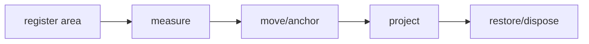

## Overview

Shared terminal scroll containers, viewports, anchoring, culling, and restoration for tuil.

`@mwillbanks/tuil-scroll` is independently installable and also participates in the
umbrella `@mwillbanks/tuil` runtime where applicable.

## Installation

```npm
npm install @mwillbanks/tuil-scroll
```

## How it operates

Shared scrolling manages bounded offsets, sticky edges, anchoring, nested wheel routing, variable measurements, culling, restoration, and scrollbar projection.



## API

| Export | Kind | Source |
| --- | --- | --- |
| `ScrollAlignment` | type | `packages/scroll/src/index.ts` |
| `ScrollAreaOptions` | interface | `packages/scroll/src/index.ts` |
| `ScrollAreaState` | class | `packages/scroll/src/index.ts` |
| `ScrollAxis` | type | `packages/scroll/src/index.ts` |
| `scrollbar` | function | `packages/scroll/src/index.ts` |
| `ScrollExtent` | interface | `packages/scroll/src/index.ts` |
| `ScrollManager` | class | `packages/scroll/src/index.ts` |
| `ScrollPosition` | interface | `packages/scroll/src/index.ts` |
| `ScrollSnapshot` | interface | `packages/scroll/src/index.ts` |
| `ScrollViewport` | interface | `packages/scroll/src/index.ts` |

## Events and lifecycle

Each area exposes immutable snapshots through a subscription.

All subscriptions and registrations return a disposer or belong to an owning
runtime that disposes them in reverse order.

## Example

```tsx
const area = new ScrollAreaState({ id: "logs", viewport, extent });
```

## Related

- [Package architecture](/docs/concepts/packages)
- [Events](/docs/concepts/events)
- [Testing](/docs/guides/testing)
