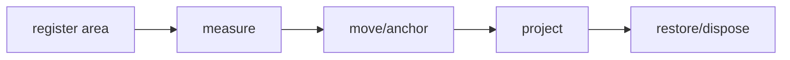

## Overview

Shared terminal scroll containers, viewports, anchoring, culling, and restoration for tuil.

`@mwillbanks/tuil-scroll` is independently installable and also participates in the
umbrella `@mwillbanks/tuil` runtime where applicable.

## Installation

```npm
npm install @mwillbanks/tuil-scroll
```

## How it operates

Shared scrolling manages bounded offsets, sticky edges, anchoring, nested wheel routing, variable measurements, culling, restoration, and scrollbar projection.



## API

| API | Signature | Description |
| --- | --- | --- |
| [`ScrollAlignment`](/docs/reference/packages/scroll/api/scroll-alignment) | `type ScrollAlignment` | Public type ScrollAlignment. |
| [`ScrollAreaOptions`](/docs/reference/packages/scroll/api/scroll-area-options) | `interface ScrollAreaOptions` | Public interface ScrollAreaOptions. |
| [`ScrollAreaState`](/docs/reference/packages/scroll/api/scroll-area-state) | `class ScrollAreaState` | Public class ScrollAreaState. |
| [`ScrollAxis`](/docs/reference/packages/scroll/api/scroll-axis) | `type ScrollAxis` | Public type ScrollAxis. |
| [`scrollbar`](/docs/reference/packages/scroll/api/scrollbar) | `function scrollbar` | Public function scrollbar. |
| [`ScrollExtent`](/docs/reference/packages/scroll/api/scroll-extent) | `interface ScrollExtent` | Public interface ScrollExtent. |
| [`ScrollManager`](/docs/reference/packages/scroll/api/scroll-manager) | `class ScrollManager` | Public class ScrollManager. |
| [`ScrollPosition`](/docs/reference/packages/scroll/api/scroll-position) | `interface ScrollPosition` | Public interface ScrollPosition. |
| [`ScrollSnapshot`](/docs/reference/packages/scroll/api/scroll-snapshot) | `interface ScrollSnapshot` | Public interface ScrollSnapshot. |
| [`ScrollViewport`](/docs/reference/packages/scroll/api/scroll-viewport) | `interface ScrollViewport` | Public interface ScrollViewport. |

## Events and lifecycle

Each area exposes immutable snapshots through a subscription.

All subscriptions and registrations return a disposer or belong to an owning
runtime that disposes them in reverse order.

## Example

```tsx
import { ScrollAreaState } from "@mwillbanks/tuil-scroll";

const area = new ScrollAreaState({ id: "logs", viewport, extent });
```

## Related

- [Package architecture](/docs/concepts/packages)
- [Events](/docs/concepts/events)
- [Testing](/docs/guides/testing)
