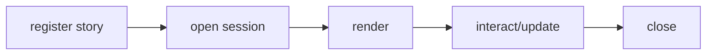

## Overview

Portable tuil stories, browser bridges, snapshots, documentation, and Storybook adapters.

`@mwillbanks/tuil-story` is independently installable and also participates in the
umbrella `@mwillbanks/tuil` runtime where applicable.

## Installation

```npm
npm install @mwillbanks/tuil-story
```

## How it operates

Portable stories combine component args with terminal capabilities, themes, semantic nodes, focus state, events, ANSI output, and an action history. Adapters expose the same story to tests, browsers, static docs, and Storybook. Dynamic and static HTTP adapters stream untrusted bodies through a byte limit, validate their complete schema, bound recursive args, controls, dimensions, and simulated input, and apply a server-side timeout before render-lock acquisition.



## API

| Export | Kind | Source |
| --- | --- | --- |
| `ansiFrameToHtml` | function | `packages/story/src/browser.tsx` |
| `browserStories` | function | `packages/story/src/browser.tsx` |
| `BrowserStorySet` | interface | `packages/story/src/browser.tsx` |
| `componentArgsFromAdapterArgs` | function | `packages/story/src/browser.tsx` |
| `createFumadocsStoryAdapter` | function | `packages/story/src/browser.tsx` |
| `createStaticStoryHttpHandler` | function | `packages/story/src/static.ts` |
| `createStorybookAdapter` | function | `packages/story/src/storybook.tsx` |
| `createStoryHttpHandler` | function | `packages/story/src/index.tsx` |
| `createTerminalStoryFrameEffect` | function | `packages/story/src/browser.tsx` |
| `defaultTerminalStoryControls` | export | `packages/story/src/index.tsx` |
| `defineTuilStories` | export | `packages/story/src/index.tsx` |
| `FumadocsStoryConfig` | interface | `packages/story/src/browser.tsx` |
| `FumadocsStoryProps` | type | `packages/story/src/browser.tsx` |
| `generateStoryCatalogDocumentation` | function | `packages/story/src/index.tsx` |
| `generateStoryCatalogSnapshots` | function | `packages/story/src/index.tsx` |
| `handleStoryHttpRequest` | function | `packages/story/src/index.tsx` |
| `OpenStoryOptions` | interface | `packages/story/src/index.tsx` |
| `renderStaticStoryRequest` | function | `packages/story/src/static.ts` |
| `renderStoryRequest` | function | `packages/story/src/index.tsx` |
| `StaticStoryCatalog` | class | `packages/story/src/static.ts` |
| `StaticStoryFrame` | type | `packages/story/src/static.ts` |
| `StaticStoryRequest` | interface | `packages/story/src/static.ts` |
| `StoryAction` | interface | `packages/story/src/index.tsx` |
| `StorybookAdapter` | interface | `packages/story/src/storybook.tsx` |
| `StoryBridgeRequest` | interface | `packages/story/src/index.tsx` |
| `StoryCatalogSnapshots` | type | `packages/story/src/index.tsx` |
| `StoryFrame` | interface | `packages/story/src/index.tsx` |
| `storyFrameToMarkdown` | function | `packages/story/src/index.tsx` |
| `StoryHttpHandlerOptions` | interface | `packages/story/src/index.tsx` |
| `storyHttpLimits` | constant | `packages/story/src/index.tsx` |
| `StorySnapshot` | interface | `packages/story/src/index.tsx` |
| `terminalControlArgNames` | constant | `packages/story/src/browser.tsx` |
| `terminalControlsFromArgs` | function | `packages/story/src/browser.tsx` |
| `terminalControlsToArgs` | function | `packages/story/src/browser.tsx` |
| `TerminalStoryControls` | export | `packages/story/src/index.tsx` |
| `TerminalStoryFrame` | function | `packages/story/src/browser.tsx` |
| `TerminalStoryFrameEffectOptions` | interface | `packages/story/src/browser.tsx` |
| `TerminalStoryFrameProps` | interface | `packages/story/src/browser.tsx` |
| `TerminalStoryFrameView` | function | `packages/story/src/browser.tsx` |
| `TerminalStoryFrameViewProps` | interface | `packages/story/src/browser.tsx` |
| `TuilStory` | export | `packages/story/src/index.tsx` |
| `TuilStoryCatalog` | class | `packages/story/src/index.tsx` |
| `TuilStoryDefinition` | export | `packages/story/src/index.tsx` |
| `TuilStorySession` | class | `packages/story/src/index.tsx` |
| `TuilStorySet` | interface | `packages/story/src/index.tsx` |
| `validateStoryBridgeRequest` | function | `packages/story/src/index.tsx` |

## Events and lifecycle

Every rendered frame captures the runtime's observed event history and story action timeline. HTTP request failures return 400, client disconnects return 499, and render timeouts return 504.

All subscriptions and registrations return a disposer or belong to an owning
runtime that disposes them in reverse order.

## Example

```tsx
export const stories = defineTuilStories({ component: Button, stories: { Default: { args: { children: "Run" } } } });
```

## Related

- [Package architecture](/docs/concepts/packages)
- [Events](/docs/concepts/events)
- [Testing](/docs/guides/testing)
