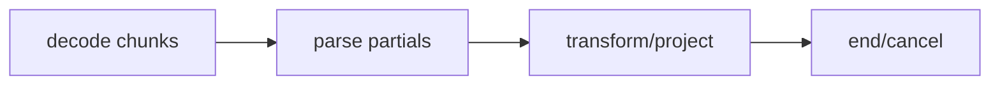

## Overview

Extensible backpressure-aware streaming parsers, transformers, and projections for tuil.

`@mwillbanks/tuil-streaming` is independently installable and also participates in the
umbrella `@mwillbanks/tuil` runtime where applicable.

## Installation

```npm
npm install @mwillbanks/tuil-streaming
```

## How it operates

Streaming pipelines incrementally decode and parse common text formats with cancellation, backpressure, transforms, projections, diagnostics, bounded source, and replay.



## API

| API | Signature | Description |
| --- | --- | --- |
| [`BackpressureController`](/docs/reference/packages/streaming/api/backpressure-controller) | `interface BackpressureController` | Public interface BackpressureController. |
| [`BoundedBackpressureController`](/docs/reference/packages/streaming/api/bounded-backpressure-controller) | `class BoundedBackpressureController` | Public class BoundedBackpressureController. |
| [`builtInDocumentTransformers`](/docs/reference/packages/streaming/api/built-in-document-transformers) | `constant builtInDocumentTransformers` | Public constant builtInDocumentTransformers. |
| [`builtInFormatParsers`](/docs/reference/packages/streaming/api/built-in-format-parsers) | `constant builtInFormatParsers` | Public constant builtInFormatParsers. |
| [`builtInRenderProjections`](/docs/reference/packages/streaming/api/built-in-render-projections) | `constant builtInRenderProjections` | Public constant builtInRenderProjections. |
| [`DocumentNode`](/docs/reference/packages/streaming/api/document-node) | `interface DocumentNode` | Public interface DocumentNode. |
| [`DocumentTransformer`](/docs/reference/packages/streaming/api/document-transformer) | `interface DocumentTransformer` | Public interface DocumentTransformer. |
| [`FormatParser`](/docs/reference/packages/streaming/api/format-parser) | `interface FormatParser` | Public interface FormatParser. |
| [`FormatParserSession`](/docs/reference/packages/streaming/api/format-parser-session) | `interface FormatParserSession` | Public interface FormatParserSession. |
| [`ParserDiagnostic`](/docs/reference/packages/streaming/api/parser-diagnostic) | `interface ParserDiagnostic` | Public interface ParserDiagnostic. |
| [`PartialDocument`](/docs/reference/packages/streaming/api/partial-document) | `interface PartialDocument` | Public interface PartialDocument. |
| [`RenderProjection`](/docs/reference/packages/streaming/api/render-projection) | `interface RenderProjection` | Public interface RenderProjection. |
| [`SourceSpan`](/docs/reference/packages/streaming/api/source-span) | `interface SourceSpan` | Public interface SourceSpan. |
| [`StreamDecoder`](/docs/reference/packages/streaming/api/stream-decoder) | `interface StreamDecoder` | Public interface StreamDecoder. |
| [`StreamEvent`](/docs/reference/packages/streaming/api/stream-event) | `type StreamEvent` | Public type StreamEvent. |
| [`StreamRenderer`](/docs/reference/packages/streaming/api/stream-renderer) | `interface StreamRenderer` | Public interface StreamRenderer. |
| [`Utf8StreamDecoder`](/docs/reference/packages/streaming/api/utf8-stream-decoder) | `class Utf8StreamDecoder` | Public class Utf8StreamDecoder. |

## Events and lifecycle

Typed start, document, diagnostic, and end events carry monotonically increasing sequence numbers.

All subscriptions and registrations return a disposer or belong to an owning
runtime that disposes them in reverse order.

## Example

```tsx
const pipeline = new StreamingPipeline({ format: "jsonl" });
await pipeline.write(chunk);
```

## Related

- [Package architecture](/docs/concepts/packages)
- [Events](/docs/concepts/events)
- [Testing](/docs/guides/testing)
