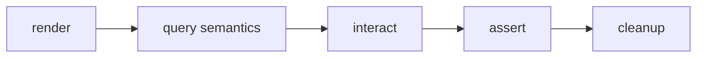

## Overview

Semantic assertions, screens, and portable story contracts for testing tuil applications.

`@mwillbanks/tuil-testing` is independently installable and also participates in the
umbrella `@mwillbanks/tuil` runtime where applicable.

## Installation

```npm
npm install @mwillbanks/tuil-testing
```

## How it operates

Testing contracts query semantic output instead of terminal coordinates, define portable stories, and provide screen-style role, label, state, and text assertions.



## API

| API | Signature | Description |
| --- | --- | --- |
| [`defaultTerminalStoryControls`](/docs/reference/packages/testing/api/default-terminal-story-controls) | `constant defaultTerminalStoryControls` | Public constant defaultTerminalStoryControls. |
| [`defineTuilStories`](/docs/reference/packages/testing/api/define-tuil-stories) | `function defineTuilStories` | Public function defineTuilStories. |
| [`normalizeTerminalFrame`](/docs/reference/packages/testing/api/normalize-terminal-frame) | `function normalizeTerminalFrame` | Public function normalizeTerminalFrame. |
| [`QueryableSemanticNode`](/docs/reference/packages/testing/api/queryable-semantic-node) | `interface QueryableSemanticNode` | Public interface QueryableSemanticNode. |
| [`SemanticQuery`](/docs/reference/packages/testing/api/semantic-query) | `interface SemanticQuery` | Public interface SemanticQuery. |
| [`SemanticScreen`](/docs/reference/packages/testing/api/semantic-screen) | `class SemanticScreen` | Public class SemanticScreen. |
| [`SemanticSnapshot`](/docs/reference/packages/testing/api/semantic-snapshot) | `interface SemanticSnapshot` | Public interface SemanticSnapshot. |
| [`TerminalStoryControls`](/docs/reference/packages/testing/api/terminal-story-controls) | `interface TerminalStoryControls` | Public interface TerminalStoryControls. |
| [`TuilStory`](/docs/reference/packages/testing/api/tuil-story) | `interface TuilStory` | Public interface TuilStory. |
| [`TuilStoryDefinition`](/docs/reference/packages/testing/api/tuil-story-definition) | `interface TuilStoryDefinition` | Public interface TuilStoryDefinition. |

## Events and lifecycle

Story and test results expose captured runtime events for deterministic assertions.

All subscriptions and registrations return a disposer or belong to an owning
runtime that disposes them in reverse order.

## Example

```tsx
expect(screen.getByRole("button", { name: "Run" })).toBeEnabled();
```

## Related

- [Package architecture](/docs/concepts/packages)
- [Events](/docs/concepts/events)
- [Testing](/docs/guides/testing)
