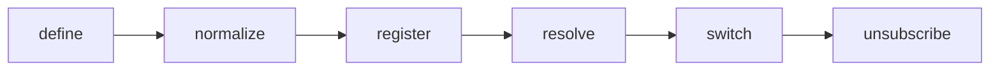

## Overview

Theme tokens, variants, utilities, capabilities, and registries for tuil.

`@mwillbanks/tuil-theme` is independently installable and also participates in the
umbrella `@mwillbanks/tuil` runtime where applicable.

## Installation

```npm
npm install @mwillbanks/tuil-theme
```

## How it operates

Themes normalize token sets, component defaults, slots, variants, terminal capabilities, and spacing. Registries resolve named themes while `ThemeController` provides live observable switching.



## API

| Export | Kind | Source |
| --- | --- | --- |
| `ColorScheme` | type | `packages/theme/src/index.ts` |
| `compileUtilities` | function | `packages/theme/src/index.ts` |
| `ComponentTheme` | interface | `packages/theme/src/index.ts` |
| `createDefaultThemeRegistry` | function | `packages/theme/src/index.ts` |
| `createTheme` | function | `packages/theme/src/index.ts` |
| `defaultLightTheme` | constant | `packages/theme/src/index.ts` |
| `defaultTheme` | constant | `packages/theme/src/index.ts` |
| `normalizeTheme` | function | `packages/theme/src/index.ts` |
| `resolveComponentProps` | function | `packages/theme/src/index.ts` |
| `resolveSlotProps` | function | `packages/theme/src/index.ts` |
| `SemanticColor` | interface | `packages/theme/src/index.ts` |
| `SlotComponents` | type | `packages/theme/src/index.ts` |
| `SlotMap` | type | `packages/theme/src/index.ts` |
| `SlotPropFactory` | type | `packages/theme/src/index.ts` |
| `SlotProps` | type | `packages/theme/src/index.ts` |
| `SlottedComponentProps` | interface | `packages/theme/src/index.ts` |
| `SpacingToken` | type | `packages/theme/src/index.ts` |
| `TerminalStyleProps` | type | `packages/theme/src/index.ts` |
| `Theme` | interface | `packages/theme/src/index.ts` |
| `ThemeController` | class | `packages/theme/src/index.ts` |
| `ThemeFactory` | type | `packages/theme/src/index.ts` |
| `ThemeInput` | type | `packages/theme/src/index.ts` |
| `ThemeProvider` | function | `packages/theme/src/index.ts` |
| `ThemeRegistry` | class | `packages/theme/src/index.ts` |
| `ThemeRegistryEntry` | interface | `packages/theme/src/index.ts` |
| `useTheme` | function | `packages/theme/src/index.ts` |

## Events and lifecycle

Theme changes use `ThemeController.subscribe()` so React consumers remain consistent with `useSyncExternalStore`.

All subscriptions and registrations return a disposer or belong to an owning
runtime that disposes them in reverse order.

## Example

```tsx
const themes = createDefaultThemeRegistry();
app.themeController.set(themes.resolve("default-light"));
```

## Related

- [Package architecture](/docs/concepts/packages)
- [Events](/docs/concepts/events)
- [Testing](/docs/guides/testing)
