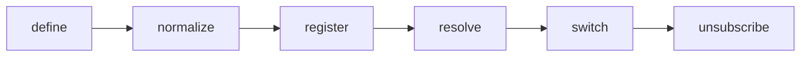

## Overview

Theme tokens, variants, utilities, capabilities, and registries for tuil.

`@mwillbanks/tuil-theme` is independently installable and also participates in the
umbrella `@mwillbanks/tuil` runtime where applicable.

## Installation

```npm
npm install @mwillbanks/tuil-theme
```

## How it operates

Themes normalize token sets, component defaults, slots, variants, terminal capabilities, and spacing. Registries resolve named themes while `ThemeController` provides live observable switching.



## API

| API | Signature | Description |
| --- | --- | --- |
| [`ColorScheme`](/docs/reference/packages/theme/api/color-scheme) | `type ColorScheme` | Public type ColorScheme. |
| [`compileUtilities`](/docs/reference/packages/theme/api/compile-utilities) | `function compileUtilities` | Public function compileUtilities. |
| [`ComponentTheme`](/docs/reference/packages/theme/api/component-theme) | `interface ComponentTheme` | Public interface ComponentTheme. |
| [`createDefaultThemeRegistry`](/docs/reference/packages/theme/api/create-default-theme-registry) | `function createDefaultThemeRegistry` | Public function createDefaultThemeRegistry. |
| [`createTheme`](/docs/reference/packages/theme/api/create-theme) | `function createTheme` | Public function createTheme. |
| [`defaultLightTheme`](/docs/reference/packages/theme/api/default-light-theme) | `constant defaultLightTheme` | Public constant defaultLightTheme. |
| [`defaultTheme`](/docs/reference/packages/theme/api/default-theme) | `constant defaultTheme` | Public constant defaultTheme. |
| [`normalizeTheme`](/docs/reference/packages/theme/api/normalize-theme) | `function normalizeTheme` | Public function normalizeTheme. |
| [`resolveComponentProps`](/docs/reference/packages/theme/api/resolve-component-props) | `function resolveComponentProps` | Public function resolveComponentProps. |
| [`resolveSlotProps`](/docs/reference/packages/theme/api/resolve-slot-props) | `function resolveSlotProps` | Public function resolveSlotProps. |
| [`SemanticColor`](/docs/reference/packages/theme/api/semantic-color) | `interface SemanticColor` | Public interface SemanticColor. |
| [`SlotComponents`](/docs/reference/packages/theme/api/slot-components) | `type SlotComponents` | Public type SlotComponents. |
| [`SlotMap`](/docs/reference/packages/theme/api/slot-map) | `type SlotMap` | Public type SlotMap. |
| [`SlotPropFactory`](/docs/reference/packages/theme/api/slot-prop-factory) | `type SlotPropFactory` | Public type SlotPropFactory. |
| [`SlotProps`](/docs/reference/packages/theme/api/slot-props) | `type SlotProps` | Public type SlotProps. |
| [`SlottedComponentProps`](/docs/reference/packages/theme/api/slotted-component-props) | `interface SlottedComponentProps` | Public interface SlottedComponentProps. |
| [`SpacingToken`](/docs/reference/packages/theme/api/spacing-token) | `type SpacingToken` | Public type SpacingToken. |
| [`TerminalStyleProps`](/docs/reference/packages/theme/api/terminal-style-props) | `type TerminalStyleProps` | Public type TerminalStyleProps. |
| [`Theme`](/docs/reference/packages/theme/api/theme) | `interface Theme` | Public interface Theme. |
| [`ThemeController`](/docs/reference/packages/theme/api/theme-controller) | `class ThemeController` | Public class ThemeController. |
| [`ThemeFactory`](/docs/reference/packages/theme/api/theme-factory) | `type ThemeFactory` | Public type ThemeFactory. |
| [`ThemeInput`](/docs/reference/packages/theme/api/theme-input) | `type ThemeInput` | Public type ThemeInput. |
| [`ThemeProvider`](/docs/reference/packages/theme/api/theme-provider) | `function ThemeProvider` | Public function ThemeProvider. |
| [`ThemeRegistry`](/docs/reference/packages/theme/api/theme-registry) | `class ThemeRegistry` | Public class ThemeRegistry. |
| [`ThemeRegistryEntry`](/docs/reference/packages/theme/api/theme-registry-entry) | `interface ThemeRegistryEntry` | Public interface ThemeRegistryEntry. |
| [`useTheme`](/docs/reference/packages/theme/api/use-theme) | `function useTheme` | Public function useTheme. |

## Events and lifecycle

Theme changes use `ThemeController.subscribe()` so React consumers remain consistent with `useSyncExternalStore`.

All subscriptions and registrations return a disposer or belong to an owning
runtime that disposes them in reverse order.

## Example

```tsx
import { createDefaultThemeRegistry } from "@mwillbanks/tuil-theme";

const themes = createDefaultThemeRegistry();
app.themeController.set(themes.resolve("default-light"));
```

## Related

- [Package architecture](/docs/concepts/packages)
- [Events](/docs/concepts/events)
- [Testing](/docs/guides/testing)
