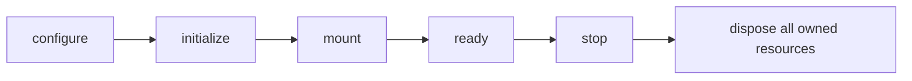

## Overview

A renderer-neutral terminal application runtime with React Ink compatibility.

`@mwillbanks/tuil` is independently installable and also participates in the
umbrella `@mwillbanks/tuil` runtime where applicable.

## Installation

```npm
npm install @mwillbanks/tuil
```

## How it operates

The umbrella runtime owns the application boundary: lifecycle, services, commands, focus, hotkeys, event bus, terminal capabilities, theme controller, plugins, extension registries, and the root component.



## API

| API | Signature | Description |
| --- | --- | --- |
| [`AppErrorPayload`](/docs/reference/packages/tuil/api/app-error-payload) | `interface AppErrorPayload` | Public interface AppErrorPayload. |
| [`AppEventMap`](/docs/reference/packages/tuil/api/app-event-map) | `type AppEventMap` | Public type AppEventMap. |
| [`AppLifecycleEvents`](/docs/reference/packages/tuil/api/app-lifecycle-events) | `type AppLifecycleEvents` | Public type AppLifecycleEvents. |
| [`AppLifecyclePayload`](/docs/reference/packages/tuil/api/app-lifecycle-payload) | `interface AppLifecyclePayload` | Public interface AppLifecyclePayload. |
| [`AppLifecycleState`](/docs/reference/packages/tuil/api/app-lifecycle-state) | `type AppLifecycleState` | Public type AppLifecycleState. |
| [`ColorDepth`](/docs/reference/packages/tuil/api/color-depth) | `type ColorDepth` | Public type ColorDepth. |
| [`Command`](/docs/reference/packages/tuil/api/command) | `interface Command` | Public interface Command. |
| [`CommandContext`](/docs/reference/packages/tuil/api/command-context) | `interface CommandContext` | Public interface CommandContext. |
| [`CommandExecution`](/docs/reference/packages/tuil/api/command-execution) | `interface CommandExecution` | Public interface CommandExecution. |
| [`CommandRegistry`](/docs/reference/packages/tuil/api/command-registry) | `class CommandRegistry` | Public class CommandRegistry. |
| [`CommandRegistryChange`](/docs/reference/packages/tuil/api/command-registry-change) | `type CommandRegistryChange` | Public type CommandRegistryChange. |
| [`createGlobalSearchExpression`](/docs/reference/packages/tuil/api/create-global-search-expression) | `function createGlobalSearchExpression` | Public function createGlobalSearchExpression. |
| [`createOperation`](/docs/reference/packages/tuil/api/create-operation) | `export createOperation` | Public export createOperation. |
| [`createPlugin`](/docs/reference/packages/tuil/api/create-plugin) | `export createPlugin` | Public export createPlugin. |
| [`createRouter`](/docs/reference/packages/tuil/api/create-router) | `export createRouter` | Public export createRouter. |
| [`createTheme`](/docs/reference/packages/tuil/api/create-theme) | `export createTheme` | Public export createTheme. |
| [`createWorkflow`](/docs/reference/packages/tuil/api/create-workflow) | `export createWorkflow` | Public export createWorkflow. |
| [`defineCommand`](/docs/reference/packages/tuil/api/define-command) | `function defineCommand` | Public function defineCommand. |
| [`defineEvents`](/docs/reference/packages/tuil/api/define-events) | `export defineEvents` | Public export defineEvents. |
| [`defineOperation`](/docs/reference/packages/tuil/api/define-operation) | `export defineOperation` | Public export defineOperation. |
| [`defineOperationStep`](/docs/reference/packages/tuil/api/define-operation-step) | `export defineOperationStep` | Public export defineOperationStep. |
| [`defineRoutes`](/docs/reference/packages/tuil/api/define-routes) | `export defineRoutes` | Public export defineRoutes. |
| [`defineService`](/docs/reference/packages/tuil/api/define-service) | `function defineService` | Public function defineService. |
| [`defineStep`](/docs/reference/packages/tuil/api/define-step) | `export defineStep` | Public export defineStep. |
| [`defineWorkflow`](/docs/reference/packages/tuil/api/define-workflow) | `export defineWorkflow` | Public export defineWorkflow. |
| [`deleteOnDispose`](/docs/reference/packages/tuil/api/delete-on-dispose) | `function deleteOnDispose` | Public function deleteOnDispose. |
| [`detectTerminalCapabilities`](/docs/reference/packages/tuil/api/detect-terminal-capabilities) | `function detectTerminalCapabilities` | Public function detectTerminalCapabilities. |
| [`Disposable`](/docs/reference/packages/tuil/api/disposable) | `interface Disposable` | Public interface Disposable. |
| [`DisposableStack`](/docs/reference/packages/tuil/api/disposable-stack) | `class DisposableStack` | Public class DisposableStack. |
| [`Disposer`](/docs/reference/packages/tuil/api/disposer) | `type Disposer` | Public type Disposer. |
| [`ErrorHandler`](/docs/reference/packages/tuil/api/error-handler) | `type ErrorHandler` | Public type ErrorHandler. |
| [`escapeTerminalControlCharacters`](/docs/reference/packages/tuil/api/escape-terminal-control-characters) | `function escapeTerminalControlCharacters` | Public function escapeTerminalControlCharacters. |
| [`event`](/docs/reference/packages/tuil/api/event) | `export event` | Public export event. |
| [`EventDefinition`](/docs/reference/packages/tuil/api/event-definition) | `export EventDefinition` | Public export EventDefinition. |
| [`EventDefinitions`](/docs/reference/packages/tuil/api/event-definitions) | `export EventDefinitions` | Public export EventDefinitions. |
| [`EventMap`](/docs/reference/packages/tuil/api/event-map) | `export EventMap` | Public export EventMap. |
| [`ExtensionRegistries`](/docs/reference/packages/tuil/api/extension-registries) | `type ExtensionRegistries` | Public type ExtensionRegistries. |
| [`hasTerminalControlCharacters`](/docs/reference/packages/tuil/api/has-terminal-control-characters) | `function hasTerminalControlCharacters` | Public function hasTerminalControlCharacters. |
| [`isSafeRegularExpressionSource`](/docs/reference/packages/tuil/api/is-safe-regular-expression-source) | `function isSafeRegularExpressionSource` | Public function isSafeRegularExpressionSource. |
| [`Lifecycle`](/docs/reference/packages/tuil/api/lifecycle) | `class Lifecycle` | Public class Lifecycle. |
| [`NavigationEntry`](/docs/reference/packages/tuil/api/navigation-entry) | `export NavigationEntry` | Public export NavigationEntry. |
| [`NavigationSurface`](/docs/reference/packages/tuil/api/navigation-surface) | `export NavigationSurface` | Public export NavigationSurface. |
| [`NavigationTarget`](/docs/reference/packages/tuil/api/navigation-target) | `export NavigationTarget` | Public export NavigationTarget. |
| [`ObservedEvent`](/docs/reference/packages/tuil/api/observed-event) | `export ObservedEvent` | Public export ObservedEvent. |
| [`OperationDefinition`](/docs/reference/packages/tuil/api/operation-definition) | `export OperationDefinition` | Public export OperationDefinition. |
| [`OperationExecutor`](/docs/reference/packages/tuil/api/operation-executor) | `export OperationExecutor` | Public export OperationExecutor. |
| [`OperationProgress`](/docs/reference/packages/tuil/api/operation-progress) | `export OperationProgress` | Public export OperationProgress. |
| [`OperationSnapshot`](/docs/reference/packages/tuil/api/operation-snapshot) | `export OperationSnapshot` | Public export OperationSnapshot. |
| [`OperationStatus`](/docs/reference/packages/tuil/api/operation-status) | `export OperationStatus` | Public export OperationStatus. |
| [`PersistedWorkflow`](/docs/reference/packages/tuil/api/persisted-workflow) | `export PersistedWorkflow` | Public export PersistedWorkflow. |
| [`Plugin`](/docs/reference/packages/tuil/api/plugin) | `export Plugin` | Public export Plugin. |
| [`PluginCapability`](/docs/reference/packages/tuil/api/plugin-capability) | `export PluginCapability` | Public export PluginCapability. |
| [`RenderMode`](/docs/reference/packages/tuil/api/render-mode) | `export RenderMode` | Public export RenderMode. |
| [`RenderMode`](/docs/reference/packages/tuil/api/render-mode) | `type RenderMode` | Public type RenderMode. |
| [`resolveRenderMode`](/docs/reference/packages/tuil/api/resolve-render-mode) | `function resolveRenderMode` | Public function resolveRenderMode. |
| [`resolveTerminalViewport`](/docs/reference/packages/tuil/api/resolve-terminal-viewport) | `function resolveTerminalViewport` | Public function resolveTerminalViewport. |
| [`route`](/docs/reference/packages/tuil/api/route) | `export route` | Public export route. |
| [`RouteDefinition`](/docs/reference/packages/tuil/api/route-definition) | `export RouteDefinition` | Public export RouteDefinition. |
| [`RouteMatch`](/docs/reference/packages/tuil/api/route-match) | `export RouteMatch` | Public export RouteMatch. |
| [`RouterEvent`](/docs/reference/packages/tuil/api/router-event) | `export RouterEvent` | Public export RouterEvent. |
| [`RouterState`](/docs/reference/packages/tuil/api/router-state) | `export RouterState` | Public export RouterState. |
| [`RuntimeComponentContribution`](/docs/reference/packages/tuil/api/runtime-component-contribution) | `interface RuntimeComponentContribution` | Public interface RuntimeComponentContribution. |
| [`RuntimeLogPipelineOptions`](/docs/reference/packages/tuil/api/runtime-log-pipeline-options) | `type RuntimeLogPipelineOptions` | Public type RuntimeLogPipelineOptions. |
| [`RuntimeRenderSnapshot`](/docs/reference/packages/tuil/api/runtime-render-snapshot) | `interface RuntimeRenderSnapshot` | Public interface RuntimeRenderSnapshot. |
| [`RuntimeRenderTelemetry`](/docs/reference/packages/tuil/api/runtime-render-telemetry) | `class RuntimeRenderTelemetry` | Public class RuntimeRenderTelemetry. |
| [`RuntimeResourceEntry`](/docs/reference/packages/tuil/api/runtime-resource-entry) | `interface RuntimeResourceEntry` | Public interface RuntimeResourceEntry. |
| [`RuntimeResourceRegistry`](/docs/reference/packages/tuil/api/runtime-resource-registry) | `class RuntimeResourceRegistry` | Public class RuntimeResourceRegistry. |
| [`RuntimeStreamingPipelineOptions`](/docs/reference/packages/tuil/api/runtime-streaming-pipeline-options) | `type RuntimeStreamingPipelineOptions` | Public type RuntimeStreamingPipelineOptions. |
| [`SemanticMetadata`](/docs/reference/packages/tuil/api/semantic-metadata) | `interface SemanticMetadata` | Public interface SemanticMetadata. |
| [`SemanticRole`](/docs/reference/packages/tuil/api/semantic-role) | `type SemanticRole` | Public type SemanticRole. |
| [`ServiceContainer`](/docs/reference/packages/tuil/api/service-container) | `class ServiceContainer` | Public class ServiceContainer. |
| [`ServiceDefinition`](/docs/reference/packages/tuil/api/service-definition) | `interface ServiceDefinition` | Public interface ServiceDefinition. |
| [`ServiceFactoryContext`](/docs/reference/packages/tuil/api/service-factory-context) | `interface ServiceFactoryContext` | Public interface ServiceFactoryContext. |
| [`ServiceInput`](/docs/reference/packages/tuil/api/service-input) | `type ServiceInput` | Public type ServiceInput. |
| [`ServiceMap`](/docs/reference/packages/tuil/api/service-map) | `type ServiceMap` | Public type ServiceMap. |
| [`sliceTerminalText`](/docs/reference/packages/tuil/api/slice-terminal-text) | `function sliceTerminalText` | Public function sliceTerminalText. |
| [`TerminalBounds`](/docs/reference/packages/tuil/api/terminal-bounds) | `interface TerminalBounds` | Public interface TerminalBounds. |
| [`TerminalCapabilities`](/docs/reference/packages/tuil/api/terminal-capabilities) | `interface TerminalCapabilities` | Public interface TerminalCapabilities. |
| [`TerminalCapabilityInput`](/docs/reference/packages/tuil/api/terminal-capability-input) | `interface TerminalCapabilityInput` | Public interface TerminalCapabilityInput. |
| [`TerminalInputProbe`](/docs/reference/packages/tuil/api/terminal-input-probe) | `interface TerminalInputProbe` | Public interface TerminalInputProbe. |
| [`TerminalOptions`](/docs/reference/packages/tuil/api/terminal-options) | `interface TerminalOptions` | Public interface TerminalOptions. |
| [`TerminalOutputProbe`](/docs/reference/packages/tuil/api/terminal-output-probe) | `interface TerminalOutputProbe` | Public interface TerminalOutputProbe. |
| [`TerminalPlatform`](/docs/reference/packages/tuil/api/terminal-platform) | `type TerminalPlatform` | Public type TerminalPlatform. |
| [`TerminalRouter`](/docs/reference/packages/tuil/api/terminal-router) | `export TerminalRouter` | Public export TerminalRouter. |
| [`terminalTextWidth`](/docs/reference/packages/tuil/api/terminal-text-width) | `function terminalTextWidth` | Public function terminalTextWidth. |
| [`TerminalViewport`](/docs/reference/packages/tuil/api/terminal-viewport) | `type TerminalViewport` | Public type TerminalViewport. |
| [`terminalViewportBreakpoints`](/docs/reference/packages/tuil/api/terminal-viewport-breakpoints) | `constant terminalViewportBreakpoints` | Public constant terminalViewportBreakpoints. |
| [`Theme`](/docs/reference/packages/tuil/api/theme) | `export Theme` | Public export Theme. |
| [`ThemeFactory`](/docs/reference/packages/tuil/api/theme-factory) | `export ThemeFactory` | Public export ThemeFactory. |
| [`toDisposable`](/docs/reference/packages/tuil/api/to-disposable) | `function toDisposable` | Public function toDisposable. |
| [`transition`](/docs/reference/packages/tuil/api/transition) | `export transition` | Public export transition. |
| [`truncateTerminalText`](/docs/reference/packages/tuil/api/truncate-terminal-text) | `function truncateTerminalText` | Public function truncateTerminalText. |
| [`TuilAppOptions`](/docs/reference/packages/tuil/api/tuil-app-options) | `interface TuilAppOptions` | Public interface TuilAppOptions. |
| [`TuilExtensionPoints`](/docs/reference/packages/tuil/api/tuil-extension-points) | `interface TuilExtensionPoints` | Public interface TuilExtensionPoints. |
| [`TuilRuntime`](/docs/reference/packages/tuil/api/tuil-runtime) | `interface TuilRuntime` | Public interface TuilRuntime. |
| [`WorkflowDefinition`](/docs/reference/packages/tuil/api/workflow-definition) | `export WorkflowDefinition` | Public export WorkflowDefinition. |
| [`WorkflowEvent`](/docs/reference/packages/tuil/api/workflow-event) | `export WorkflowEvent` | Public export WorkflowEvent. |
| [`WorkflowRunner`](/docs/reference/packages/tuil/api/workflow-runner) | `export WorkflowRunner` | Public export WorkflowRunner. |
| [`WorkflowSnapshot`](/docs/reference/packages/tuil/api/workflow-snapshot) | `export WorkflowSnapshot` | Public export WorkflowSnapshot. |
| [`WorkflowStatus`](/docs/reference/packages/tuil/api/workflow-status) | `export WorkflowStatus` | Public export WorkflowStatus. |
| [`WorkflowStep`](/docs/reference/packages/tuil/api/workflow-step) | `export WorkflowStep` | Public export WorkflowStep. |
| [`wrapTerminalText`](/docs/reference/packages/tuil/api/wrap-terminal-text) | `function wrapTerminalText` | Public function wrapTerminalText. |

## Events and lifecycle

`app:configure`, `app:initialize`, `app:mount`, `app:ready`, `app:error`, `app:stop`, and `app:dispose` are always declared.

All subscriptions and registrations return a disposer or belong to an owning
runtime that disposes them in reverse order.

## Example

```tsx
const app = createApp({ id: "demo", component: App });
render(<App />, { app });
```

## Related

- [Package architecture](/docs/concepts/packages)
- [Events](/docs/concepts/events)
- [Testing](/docs/guides/testing)
