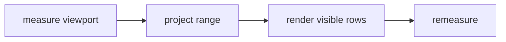

## Overview

Terminal-aware virtual lists and viewport primitives for tuil.

`@mwillbanks/tuil-virtual` is independently installable and also participates in the
umbrella `@mwillbanks/tuil` runtime where applicable.

## Installation

```npm
npm install @mwillbanks/tuil-virtual
```

## How it operates

Terminal virtualization adapts TanStack Virtual measurements to rows and columns, returning visible indexes, overscan, before/after space, and fixed-width text fitting.



## API

| API | Signature | Description |
| --- | --- | --- |
| [`getVisibleTerminalIndexes`](/docs/reference/packages/virtual/api/get-visible-terminal-indexes) | `function getVisibleTerminalIndexes` | Public function getVisibleTerminalIndexes. |
| [`TerminalVirtualizerOptions`](/docs/reference/packages/virtual/api/terminal-virtualizer-options) | `interface TerminalVirtualizerOptions` | Public interface TerminalVirtualizerOptions. |
| [`TerminalVirtualRange`](/docs/reference/packages/virtual/api/terminal-virtual-range) | `interface TerminalVirtualRange` | Public interface TerminalVirtualRange. |

## Events and lifecycle

Virtualization is pure or subscription-driven at the component layer; no global events are emitted.

All subscriptions and registrations return a disposer or belong to an owning
runtime that disposes them in reverse order.

## Example

```tsx
const range = useTerminalVirtualizer({ count: 10_000, viewportSize: 20, scrollOffset });
```

## Related

- [Package architecture](/docs/concepts/packages)
- [Events](/docs/concepts/events)
- [Testing](/docs/guides/testing)
