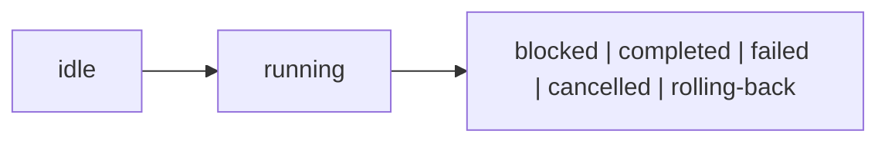

## Overview

Persistent, resumable, observable multi-step workflows for tuil applications.

`@mwillbanks/tuil-workflow` is independently installable and also participates in the
umbrella `@mwillbanks/tuil` runtime where applicable.

## Installation

```npm
npm install @mwillbanks/tuil-workflow
```

## How it operates

Workflow runners coordinate typed state, guarded transitions, validation, nested and parallel work, operations, persistence, migration, retry, cancellation, and compensation.



## API

| Export | Kind | Source |
| --- | --- | --- |
| `createWorkflow` | function | `packages/workflow/src/index.ts` |
| `defineOperationStep` | function | `packages/workflow/src/index.ts` |
| `defineStep` | function | `packages/workflow/src/index.ts` |
| `defineWorkflow` | function | `packages/workflow/src/index.ts` |
| `PersistedWorkflow` | interface | `packages/workflow/src/index.ts` |
| `transition` | function | `packages/workflow/src/index.ts` |
| `WorkflowContext` | interface | `packages/workflow/src/index.ts` |
| `WorkflowDefinition` | interface | `packages/workflow/src/index.ts` |
| `WorkflowEvent` | interface | `packages/workflow/src/index.ts` |
| `WorkflowEventType` | type | `packages/workflow/src/index.ts` |
| `WorkflowParallelBranch` | interface | `packages/workflow/src/index.ts` |
| `WorkflowParallelSnapshot` | interface | `packages/workflow/src/index.ts` |
| `WorkflowPersistence` | interface | `packages/workflow/src/index.ts` |
| `WorkflowRunner` | class | `packages/workflow/src/index.ts` |
| `WorkflowSnapshot` | interface | `packages/workflow/src/index.ts` |
| `WorkflowStatus` | type | `packages/workflow/src/index.ts` |
| `WorkflowStep` | interface | `packages/workflow/src/index.ts` |
| `WorkflowTransition` | interface | `packages/workflow/src/index.ts` |

## Events and lifecycle

`workflow:start`, `workflow:step-enter`, `workflow:step-leave`, `workflow:validate`, `workflow:skip`, `workflow:back`, `workflow:resume`, `workflow:retry`, `workflow:rollback`, `workflow:cancel`, `workflow:complete`, and `workflow:error`.

All subscriptions and registrations return a disposer or belong to an owning
runtime that disposes them in reverse order.

## Example

```tsx
const runner = createWorkflow(defineWorkflow({ id: "setup", version: 1, initialState: {}, steps, transitions }));
```

## Related

- [Package architecture](/docs/concepts/packages)
- [Events](/docs/concepts/events)
- [Testing](/docs/guides/testing)
