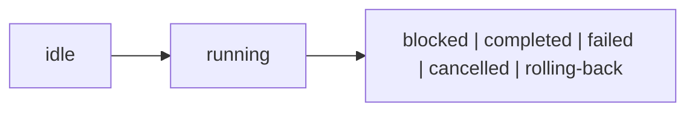

## Overview

Persistent, resumable, observable multi-step workflows for tuil applications.

`@mwillbanks/tuil-workflow` is independently installable and also participates in the
umbrella `@mwillbanks/tuil` runtime where applicable.

## Installation

```npm
npm install @mwillbanks/tuil-workflow
```

## How it operates

Workflow runners coordinate typed state, guarded transitions, validation, nested and parallel work, operations, persistence, migration, retry, cancellation, and compensation.



## API

| API | Signature | Description |
| --- | --- | --- |
| [`createWorkflow`](/docs/reference/packages/workflow/api/create-workflow) | `function createWorkflow` | Public function createWorkflow. |
| [`defineOperationStep`](/docs/reference/packages/workflow/api/define-operation-step) | `function defineOperationStep` | Public function defineOperationStep. |
| [`defineStep`](/docs/reference/packages/workflow/api/define-step) | `function defineStep` | Public function defineStep. |
| [`defineWorkflow`](/docs/reference/packages/workflow/api/define-workflow) | `function defineWorkflow` | Public function defineWorkflow. |
| [`PersistedWorkflow`](/docs/reference/packages/workflow/api/persisted-workflow) | `interface PersistedWorkflow` | Public interface PersistedWorkflow. |
| [`transition`](/docs/reference/packages/workflow/api/transition) | `function transition` | Public function transition. |
| [`WorkflowContext`](/docs/reference/packages/workflow/api/workflow-context) | `interface WorkflowContext` | Public interface WorkflowContext. |
| [`WorkflowDefinition`](/docs/reference/packages/workflow/api/workflow-definition) | `interface WorkflowDefinition` | Public interface WorkflowDefinition. |
| [`WorkflowEvent`](/docs/reference/packages/workflow/api/workflow-event) | `interface WorkflowEvent` | Public interface WorkflowEvent. |
| [`WorkflowEventType`](/docs/reference/packages/workflow/api/workflow-event-type) | `type WorkflowEventType` | Public type WorkflowEventType. |
| [`WorkflowParallelBranch`](/docs/reference/packages/workflow/api/workflow-parallel-branch) | `interface WorkflowParallelBranch` | Public interface WorkflowParallelBranch. |
| [`WorkflowParallelSnapshot`](/docs/reference/packages/workflow/api/workflow-parallel-snapshot) | `interface WorkflowParallelSnapshot` | Public interface WorkflowParallelSnapshot. |
| [`WorkflowPersistence`](/docs/reference/packages/workflow/api/workflow-persistence) | `interface WorkflowPersistence` | Public interface WorkflowPersistence. |
| [`WorkflowRunner`](/docs/reference/packages/workflow/api/workflow-runner) | `class WorkflowRunner` | Public class WorkflowRunner. |
| [`WorkflowSnapshot`](/docs/reference/packages/workflow/api/workflow-snapshot) | `interface WorkflowSnapshot` | Public interface WorkflowSnapshot. |
| [`WorkflowStatus`](/docs/reference/packages/workflow/api/workflow-status) | `type WorkflowStatus` | Public type WorkflowStatus. |
| [`WorkflowStep`](/docs/reference/packages/workflow/api/workflow-step) | `interface WorkflowStep` | Public interface WorkflowStep. |
| [`WorkflowTransition`](/docs/reference/packages/workflow/api/workflow-transition) | `interface WorkflowTransition` | Public interface WorkflowTransition. |

## Events and lifecycle

`workflow:start`, `workflow:step-enter`, `workflow:step-leave`, `workflow:validate`, `workflow:skip`, `workflow:back`, `workflow:resume`, `workflow:retry`, `workflow:rollback`, `workflow:cancel`, `workflow:complete`, and `workflow:error`.

All subscriptions and registrations return a disposer or belong to an owning
runtime that disposes them in reverse order.

## Example

```tsx
import { createWorkflow, defineWorkflow } from "@mwillbanks/tuil-workflow";

const runner = createWorkflow(defineWorkflow({ id: "setup", version: 1, initialState: {}, steps, transitions }));
```

## Related

- [Package architecture](/docs/concepts/packages)
- [Events](/docs/concepts/events)
- [Testing](/docs/guides/testing)
